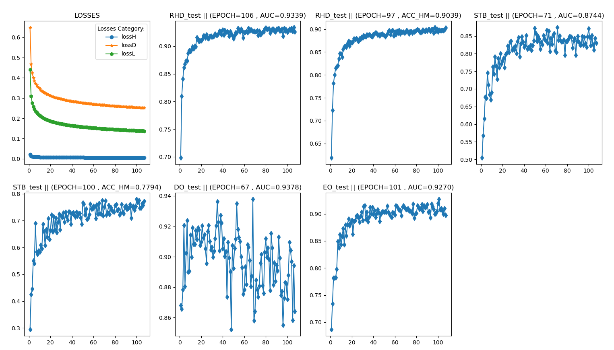

# Minimal Hand Pytorch

**Unofficial** PyTorch reimplementation of [minimal-hand](https://calciferzh.github.io/files/zhou2020monocular.pdf) (CVPR2020). 


you can also find in youtube or bilibili

<ul>
    <li>bare hand <a href='https://youtu.be/gAEyKUUwGhk'> youtube</a> or <a href='https://www.bilibili.com/video/BV1uZ4y1w7M5/'> bilibili</a> </li>
    <li>hand-object intercation <a href='https://youtu.be/XWUJEHkEMwA'> youtube</a> or <a href='https://www.bilibili.com/video/BV1mU4y1a71f/'> bilibili</a> </li>
</ul>


This project reimplement following components :
1. Training (DetNet) and Evaluation Code 
1. Shape Estimation
1. Pose Estimation: Instead of IKNet in original paper, an [analytical inverse kinematics method](https://arxiv.org/abs/2011.14672) is used.  


Offical project link:
[\[minimal-hand\]](https://github.com/CalciferZh/minimal-hand)

## Update
###
* 2021/08/22  many guys may get errors when creating environment from .yaml file, u may refer to [here](https://github.com/MengHao666/Minimal-Hand-pytorch/issues/29#issue-976328196)
* 2021/03/09  update about `utils/LM.py`, **time cost drop from 12s/item to 1.57s/item**

* 2021/03/12  update about `utils/LM.py`, **time cost drop from 1.57s/item to 0.27s/item**

* 2021/03/17  realtime perfomance is achieved when using PSO to estimate shape, coming soon

* 2021/03/20  Add PSO to  estimate shape. ~~AUC is decreased by about 0.01 on STB and RHD datasets, and increased a little on EO and do datasets.~~ Modifiy utlis/vis.py to improve realtime perfomance

* 2021/03/24 Fixed some errors in calculating AUC. Update the 3D PCK AUC Diffenence.

* 2021/06/14 A new method to estimate shape parameters by using fully connected neural network is added. This is finished by @maitetsu as part of his undergraduate graduation project. Please refer to [ShapeNet.md](./ShapeNet.md) for details. Thanks to @kishan1823 and @EEWenbinWu for pointing out the mistake. There are a little differences between the manopth I used and the official manopth. More details see [issues 11](https://github.com/MengHao666/Minimal-Hand-pytorch/issues/11). manopth/rotproj.py is the  modified rotproj.py. **This could achieve much faster real-time performance!**

  
## Usage

- Retrieve the code
```sh
git clone https://github.com/MengHao666/Minimal-Hand-pytorch
cd Minimal-Hand-pytorch
```

- Create and activate the virtual environment with python dependencies
```
conda env create --file=environment.yml
conda activate minimal-hand-torch
```

### Prepare MANO hand model
1. Download MANO model from [here](https://mano.is.tue.mpg.de/) and unzip it.
1. Create an account by clicking *Sign Up* and provide your information
1. Download Models and Code (the downloaded file should have the format mano_v*_*.zip). Note that all code and data from this download falls under the [MANO license](http://mano.is.tue.mpg.de/license).
1. unzip and copy the content of the *models* folder into the `mano` folder

1. Your structure should look like this:

```
Minimal-Hand-pytorch/
   mano/
      models/
      webuser/
```

## Download and Prepare datasets

### Training dataset
* CMU HandDB [part1](http://domedb.perception.cs.cmu.edu/panopticDB/hands/hand143_panopticdb.tar) ; [part2](http://domedb.perception.cs.cmu.edu/panopticDB/hands/hand_labels.zip)
* [Rendered Handpose Dataset](https://lmb.informatik.uni-freiburg.de/resources/datasets/RenderedHandposeDataset.en.html)
* [GANerated Hands Dataset](https://handtracker.mpi-inf.mpg.de/projects/GANeratedHands/GANeratedDataset.htm)

### Evaluation dataset
* [STB Dataset](https://github.com/zhjwustc/icip17_stereo_hand_pose_dataset)，or u can find it[here](https://bhpan.buaa.edu.cn:443/link/55321872BA66E9205C91BA30D9FADC8F):

  STB_supp: for license reason, download link could be found in [bihand](https://github.com/lixiny/bihand )
  
* [DexterObjectDataset](https://handtracker.mpi-inf.mpg.de/projects/RealtimeHO/dexter+object.htm) ;
  
  DO_supp: [Google Drive](https://drive.google.com/file/d/1uhqJGfVJs_-Yviqj9Y2Ngo7NPt5hUihl/view?usp=sharing) or 
  [Baidu Pan](https://pan.baidu.com/s/1ckfLnaBQUfZJG3IDvMo09Q) (`s892`)
* [EgoDexterDataset](http://handtracker.mpi-inf.mpg.de/projects/OccludedHands/EgoDexter.htm)

  EO_supp: [Google Drive](https://drive.google.com/file/d/1WRHVTp7ZmryE41xN2Yhp-qet0ddeOim4/view?usp=sharing) or 
  [Baidu Pan](https://pan.baidu.com/s/1sK4Nfvs6og-eXJGwDQCHlQ) (`axkm`)


### Processing
- Create a data directory, extract all above datasets or additional materials in it

Now your `data` folder structure should like this:
```
data/

    CMU/
        hand143_panopticdb/
            datasets/
            ...
        hand_labels/
            datasets/
            ...

    RHD/
        RHD_published_v2/
            evaluation/
            training/
            view_sample.py
            ...

    GANeratedHands_Release/
        data/
        ...

    STB/
        images/
            B1Counting/
                SK_color_0.png
                SK_depth_0.png
                SK_depth_seg_0.png  <-- merged from STB_supp
                ...
            ...
        labels/
            B1Counting_BB.mat
            ...

    dexter+object/
        calibration/
        bbox_dexter+object.csv
        DO_pred_2d.npy
        data/
            Grasp1/
                annotations/
                    Grasp13D.txt
                    my_Grasp13D.txt
                    ...
                ...
            Grasp2/
                annotations/
                    Grasp23D.txt
                    my_Grasp23D.txt
                    ...
                ...
            Occlusion/
                annotations/
                    Occlusion3D.txt
                    my_Occlusion3D.txt
                    ...
                ...
            Pinch/
                annotations/
                    Pinch3D.txt
                    my_Pinch3D.txt
                    ...
                ...
            Rigid/
                annotations/
                    Rigid3D.txt
                    my_Rigid3D.txt
                    ...
                ...
            Rotate/
                                annotations/
                    Rotate3D.txt
                    my_Rotate3D.txt
                    ...
                ...
        

    EgoDexter/
        preview/
        data/
            Desk/
                annotation.txt_3D.txt
                my_annotation.txt_3D.txt
                ...
            Fruits/
                annotation.txt_3D.txt
                my_annotation.txt_3D.txt
                ...
            Kitchen/
                annotation.txt_3D.txt
                my_annotation.txt_3D.txt
                ...
            Rotunda/
                annotation.txt_3D.txt
                my_annotation.txt_3D.txt
                ...
        
```

### Note
- **All code and data from these download falls under their own licenses.**
- DO represents "dexter+object" dataset; EO represents "EgoDexter" dataset
- `DO_supp` and `EO_supp` are modified from original ones.
- DO_pred_2d.npy are 2D predictions from 2D part of DetNet.
- some labels of DO and  EO is obviously wrong (u could find some examples with original labels from [dexter_object.py](datasets/dexter_object.py) or [egodexter.py](datasets/egodexter.py)), when projected into image plane, thus should be omitted.
Here come  `my_{}3D.txt` and `my_annotation.txt_3D.txt`.

## Download my Results

- my_results: [Google Drive](https://drive.google.com/file/d/1e6aG4ZSOB6Ri_1TjXI9N-1r7MtwmjA6w/view?usp=sharing) or 
  [Baidu Pan](https://pan.baidu.com/s/1Hh0ZU8p04prFVSp9bQm_IA) (`2rv7`)
- extract it in project folder
- **The parameters used in the real-time demo can be found [google_drive](https://drive.google.com/file/d/1fug29PBMo1Cb2DwAtX7f2E_yLHjDBmiM/view?usp=sharing) or [baidu](https://pan.baidu.com/s/1gr3xSkLuvsveSQ7nW1taSA) (un06). It is trained with loss of [Hand-BMC-pytorch](https://github.com/MengHao666/Hand-BMC-pytorch) together！！！**


<h2> realtime demo with PSO-based shape estimation</h2>

```
python demo.py
```

<h2> realtime demo with learing-based shape estimation</h2>

```
python demo_dl.py
```

## DetNet Training and Evaluation

Run the training code
```
python train_detnet.py --data_root data/
```


Run the evaluation code
```
python train_detnet.py --data_root data/  --datasets_test testset_name_to_test   --evaluate  --evaluate_id checkpoints_id_to_load 
```
or use my results
```
python train_detnet.py --checkpoint my_results/checkpoints  --datasets_test "rhd" --evaluate  --evaluate_id 106

python train_detnet.py --checkpoint my_results/checkpoints  --datasets_test "stb" --evaluate  --evaluate_id 71

python train_detnet.py --checkpoint my_results/checkpoints  --datasets_test "do" --evaluate  --evaluate_id 68

python train_detnet.py --checkpoint my_results/checkpoints  --datasets_test "eo" --evaluate  --evaluate_id 101
```

## Shape Estimation with LM algorithm

Run the shape optimization code. This can be very time consuming when the weight parameter is quite small.
```
python optimize_shape.py --weight 1e-5
```
or use my results
```
python optimize_shape.py --path my_results/out_testset/
```

## Pose Estimation

Run the following code which uses a analytical inverse kinematics method. 
```
python aik_pose.py
```
or use my results
```
python aik_pose.py --path my_results/out_testset/
```


### Detnet training and evaluation curve
Run the following code to see my results
```
python plot.py --out_path my_results/out_loss_auc
```

(AUC means 3D PCK, and ACC_HM means 2D PCK)


### 3D PCK AUC Diffenence

\* means this project

| Dataset | DetNet(paper) | DetNet(*) | DetNet+IKNet(paper) | DetNet+LM+AIK(*) | DetNet+PSO+AIK(*) | DetNet+DL+AIK(*) |
| :-----: | :-----------: | :-------: | :-----------------: | :--------------: | :-------------: | :-------------: |
| **RHD** |       -       |  0.9339   |        0.856        |      0.9301      | 0.9310            | 0.9272     |
| **STB** |     0.891     |  0.8744   |        0.898        |      0.8647      | 0.8671            | 0.8624    |
| **DO**  |     0.923     |  0.9378   |        0.948        |      0.9392      | 0.9342            | 0.9400  |
| **EO**  |     0.804     |  0.9270   |        0.811        |      0.9288      | 0.9277            | 0.9365   |


### Note

- Adjusting training parameters carefully, longer training time, more complicated network or **[Biomechanical Constraint Losses](https://github.com/MengHao666/Hand-BMC-pytorch)**  could further boost accuracy.
- As there is no official open source of original paper, above comparison is a little rough.

## Citation

This is the **unofficial** pytorch reimplementation of the paper "Monocular Real-time Hand Shape and Motion Capture using Multi-modal Data" (CVPR 2020).


If you find the project helpful, please star this project and cite them:
```
@inproceedings{zhou2020monocular,
  title={Monocular Real-time Hand Shape and Motion Capture using Multi-modal Data},
  author={Zhou, Yuxiao and Habermann, Marc and Xu, Weipeng and Habibie, Ikhsanul and Theobalt, Christian and Xu, Feng},
  booktitle={Proceedings of the IEEE International Conference on Computer Vision},
  pages={0--0},
  year={2020}
}
```

## Acknowledgement

- Code of Mano Pytorch Layer was adapted from [manopth](https://github.com/hassony2/manopth).

- Code for evaluating the hand PCK and AUC in `utils/eval/zimeval.py` was adapted from [hand3d](https://github.com/lmb-freiburg/hand3d).

- Part code of data augmentation, dataset parsing and utils were adapted from [bihand](https://github.com/lixiny/bihand) and [3D-Hand-Pose-Estimation](https://github.com/OlgaChernytska/3D-Hand-Pose-Estimation).

- Code of network model was adapted from [Minimal-Hand](https://github.com/lingtengqiu/Minimal-Hand).

- @Mrsirovo for the starter code of the `utils/LM.py` , @maitetsu  update it later.

- @maitetsu for the starter code of the `utils/AIK.py`，the implementation of PSO and deep-learing method for shape estimation. 
